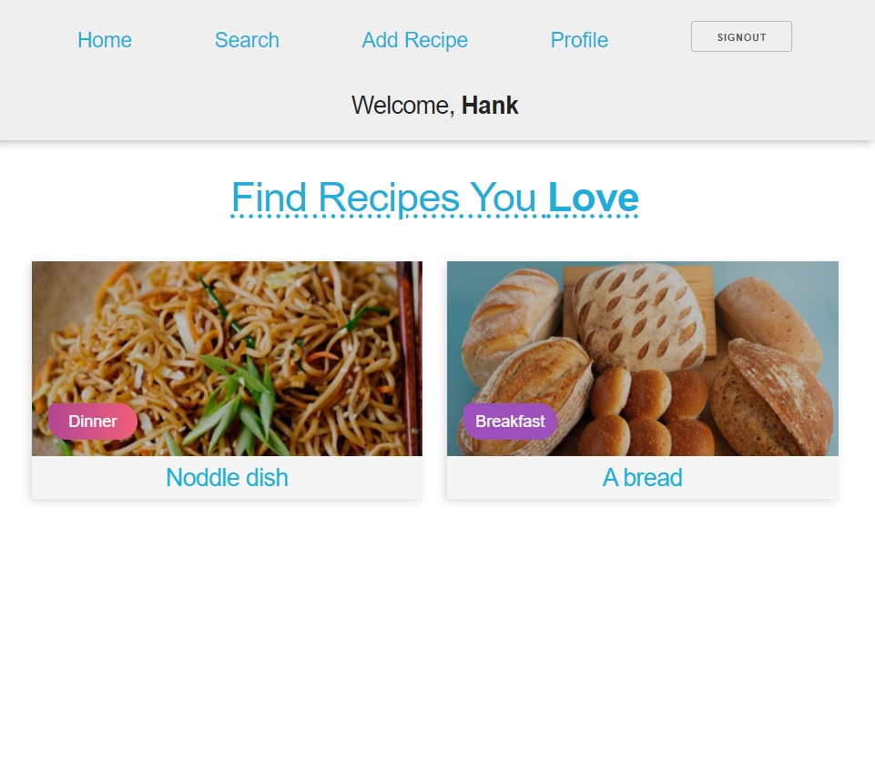
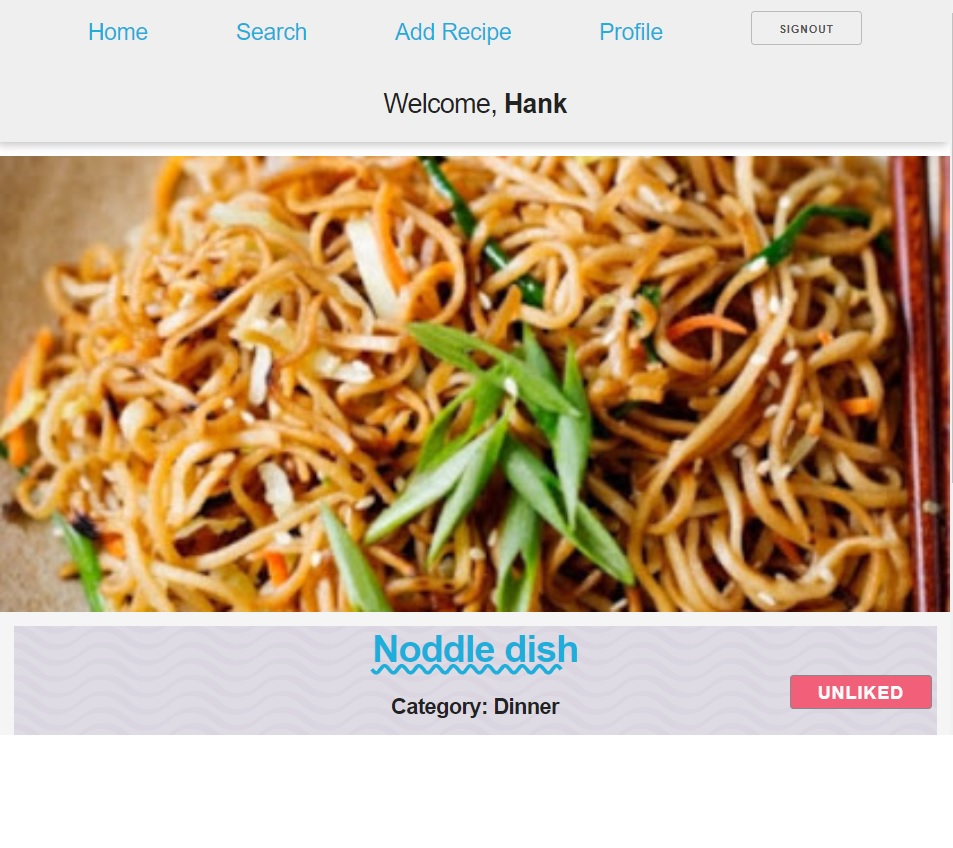
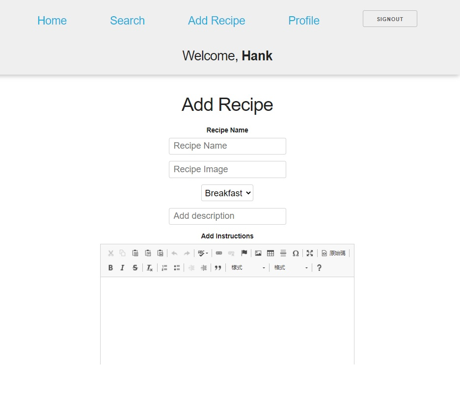
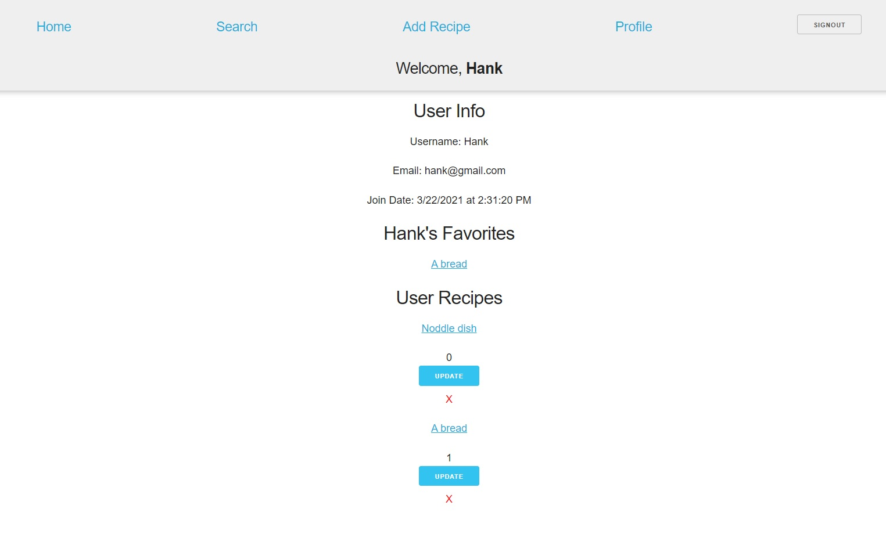

# React & GQL  部落格網站
部落格網站實作練習使用 React & node.js Gql 專案，使用 Graphql API，涵蓋 文章(CRUD)、加入我的最愛、搜尋文章，使用者(CRUD)，登入/登出等功能。

# 技術
* Node
* Mongodb
* jsonwebtoken
* React
* Hooks
* Graphql
* Apollo

# 插建
* skeleton

# variables.env
* MONGO_URI:YOUR_URL
* SECRET=YOUR_SECRET_CODE
